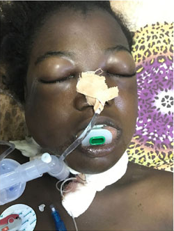
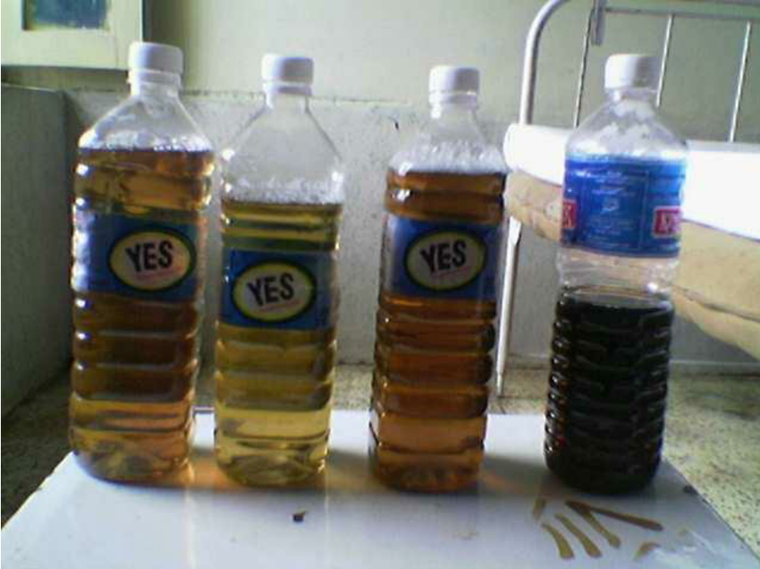

# Introduction

+ Paraphenylenediamine(PPD) is a coal-tar derivative, used as a hair dye in south asia which on oxidation produces Bondrowski's base having allergenic, mutagenic and highly toxic properties

+ Lethel dose = 6-10 grams

# Epidemology

+ Suicide by self-poisoning is a common cause of death, especially in the **younger population**.
+ Age 25.38 ± 3.77 years, 75% females.
+ Incidental poisoning in **Children**.
+ mortality rates are around 20%.

# Pathogenesis

+ **Angioedema** >> laryngospasm >> dyspnea, hypoxia,  Acute respiratory failure.
+ Rhabdomyolysis >> myocarditis = Arrhythmias.
+ Myoglobinemia >> Myoglobinuria >> Renal tubular necrosis >> ARF >> **cola coloured urine**.
+ Intravascular hemolysis >> Anemia, Hyperkalemia, Hypotension;shock.
+ Hepatic necrosis.

# images

# images

# Management Protocol
**ABCD Approach**
+ **Airway**: Perform tracheostomy and assessment of atrial blood gases (ABGs).

+ **Breathing**: Assure oxygen supply and assisted ventilation (if required).

+ **Circulation**: Save intravenous access with wide bore IV line. Assess fluid status by pulse rate, jugular venous pressure (JVP), blood pressure (in both supine and sitting conditions) and urine output (by catheterizing the patient).

+ **Disability**: Assess neurological status.

# Management Protocol
+ **Gastric lavage**: Perform gastric lavage and administer 1 gram/kg of activated charcoal.

+ **If develops hypokalemia**: Give injection calcium gluconate 8 hourly and salbutamol (Ventoline) nebulization every 3 hours.

+ **Cardiac support**: If hypotension persists despite adequate fluid resuscitation, give Injection Dopamine infusion at the rate of 6-8 micrograms per kilogram body weight per minute in order to maintain systolic blood pressure above 90 mmHg.

+ **Forced Diuresis**: Give 5-6 liters of IV fluids + injection sodium bicarbonate (Soda Bicarb) 75 mmol + injection furosemide (Lasix) 20mg every 8 hours. Give Injection Mannitol 250 cc (If the patient is still oligouric). 

+ **Dialysis**: required for patients with acute renal failure.

# Daily Investigations:
+ Send samples for hemoglobin level, renal parameters (RPMs), serum electrolytes (S/E), prothrombin time and activated partial thromboplastin time (PT/APTT), liver function tests (LFTs), creatinine phosphokinase (CPK), electrocardiogram (ECG), random blood sugar (RBS), atrial blood gases (ABGs), Ph, bicarbonate (HCO3) on daily basis.

# References
1. Omer Sultan M, Inam Khan M, Ali R, et al. (May 29, 2020) Paraphenylenediamine (Kala Pathar) Poisoning
at the National Poison Control Center in Karachi: A Prospective Study. Cureus 12(5): e8352. DOI
10.7759/cureus.8352

2. Oner, Fatih, and Umran Oner. "Intoxication Caused by Paraphenylenediamine After Henna Ingestion." Journal of Emergency Medicine Case Reports, vol. 12, no. 1, Mar. 2021, pp. 31+. Gale Academic OneFile, link.gale.com/apps/doc/A656810433/AONE?u=anon~9500721e&sid=googleScholar&xid=1b51dfb2. Accessed 11 Mar. 2024.
